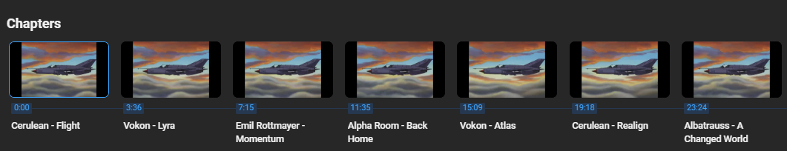
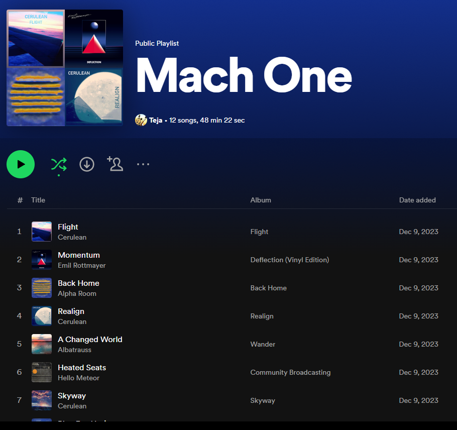

<!-- Improved compatibility of back to top link: See: https://github.com/othneildrew/Best-README-Template/pull/73 -->
<!--> README template taken from    https://github.com/othneildrew/Best-README-Template/blob/master/README.md. -->
<a name= YTToSpotify></a>

[![Contributors][contributors-shield]][contributors-url]
[![Forks][forks-shield]][forks-url]
[![Stargazers][stars-shield]][stars-url]
[![Issues][issues-shield]][issues-url]
[![MIT License][license-shield]][license-url]
[![LinkedIn][linkedin-shield]][linkedin-url]


<!-- PROJECT LOGO -->
<br />
<div align="center">
  <a href="https://github.com/TSKoduru/YTToSpotify">
    
  </a>

<h3 align="center">Youtube To Spotify</h3>

  <p align="center">
    Automating the boring process of converting YT music playlists to spotify playlists!
    <br />
    <a href="https://github.com/TSKoduru/YTToSpotify"><strong>Explore the docs »</strong></a>
    <br />
    <br />
    <a href="https://github.com/TSKoduru/YTToSpotify">View Demo</a>
    ·
    <a href="https://github.com/TSKoduru/YTToSpotify/issues">Report Bug</a>
    ·
    <a href="https://github.com/TSKoduru/YTToSpotify/issues">Request Feature</a>
  </p>
</div>


<!-- TABLE OF CONTENTS -->
<details>
  <summary>Table of Contents</summary>
  <ol>
    <li>
      <a href="#about-the-project">About The Project</a>
      <ul>
        <li><a href="#built-with">Built With</a></li>
      </ul>
    </li>
    <li>
      <a href="#getting-started">Getting Started</a>
      <ul>
        <li><a href="#prerequisites">Prerequisites</a></li>
        <li><a href="#installation">Installation</a></li>
      </ul>
    </li>
    <li><a href="#usage">Usage</a></li>
    <li><a href="#roadmap">Roadmap</a></li>
    <li><a href="#contributing">Contributing</a></li>
    <li><a href="#license">License</a></li>
    <li><a href="#contact">Contact</a></li>
  </ol>
</details>


<!-- ABOUT THE PROJECT -->
## About The Project

The objective of this project is to make a way for users to take long music playlists on YouTube and easily convert them into Spotify playlists. It uses regex to parse through the YouTube page, identify chapters, 
isolate the music in each chapter, and then use the Spotify API to combine the chapters into one playlist.
<p align="right">(<a href="#readme-top">back to top</a>)</p>


### Built With

* [![Python][Python]][Python-url]


<p align="right">(<a href="#readme-top">back to top</a>)</p>


<!-- GETTING STARTED -->
## Getting Started

There's a few libraries that you'll need to get installed before you can start messing around with playlists.
To get a local copy up and running follow these simple example steps.

### Prerequisites

This is an example of how to list things you need to use the software and how to install them.
* pip
  ```sh
   pip install re
   pip install bs4
   pip install requests
   pip install spotipy
  ```
* Spotify
    * Go to the Spotify developer page at https://developer.spotify.com/dashboard, login, and accept the privacy agreement.
    * Click the "CREATE AN APP" button and enter some dummy information (Or actual information if you want to make a spotify app!)
    * Find the "Client ID" and "Client Secret" fields and write them down for later.

### Installation

1. Clone the repo
   ```sh
   git clone https://github.com/TSKoduru/YTToSpotify.git
   ```
   
2. Enter the Client ID and Client Secret fields that you found earlier into the parameters at the top of the program. You'll also need to enter your spotify username.
   ```js
    USERNAME = 'ENTER USERNAME HERE'
    CLIENT_ID = 'ENTER CLIENT ID HERE'
    CLIENT_SECRET = 'ENTER CLIENT SECRET HERE'
   ```

<p align="right">(<a href="#readme-top">back to top</a>)</p>


<!-- USAGE EXAMPLES -->
## Usage

To use this program, all you'll need is a youtube URL that contains music _where each track is contained within its own chapter_. Click the run button, paste in the link, and then type out a name for your new playlist. The program will handle the rest :D

Example usecase:
* Suppose I want to convert the following playlist: https://www.youtube.com/watch?v=OrWEsbQVO80
* If you take a look at the video, note how each track has its own chapter: <br>
 
* I run the file, paste in the YT URL, then choose a name for the playlist.
* In a few seconds, this appears in my spotify library: <br><br>
 
* Success!


<p align="right">(<a href="#readme-top">back to top</a>)</p>

<!-- ROADMAP -->
## Roadmap

- Expand functionality to include YT videos without chapters

_Note: I've stopped developing this proejct, so open source contributions are welcome. See the contributions section below._

<p align="right">(<a href="#readme-top">back to top</a>)</p>


<!-- CONTRIBUTING -->
## Contributing

Contributions are what make the open source community such an amazing place to learn, inspire, and create. Any contributions you make are **greatly appreciated**.

If you have a suggestion that would make this better, please fork the repo and create a pull request. You can also simply open an issue with the tag "enhancement".
Don't forget to give the project a star! Thanks again!

1. Fork the Project
2. Create your Feature Branch (`git checkout -b feature/AmazingFeature`)
3. Commit your Changes (`git commit -m 'Add some AmazingFeature'`)
4. Push to the Branch (`git push origin feature/AmazingFeature`)
5. Open a Pull Request

<p align="right">(<a href="#readme-top">back to top</a>)</p>


<!-- LICENSE -->
## License

Distributed under the MIT License. See `LICENSE.txt` for more information.

<p align="right">(<a href="#readme-top">back to top</a>)</p>


<!-- CONTACT -->
## Contact

Teja Koduru - tkoduru@umich.edu

Project Link: [https://github.com/TSKoduru/YTToSpotify](https://github.com/TSKoduru/YTToSpotify)

<p align="right">(<a href="#readme-top">back to top</a>)</p>


<!-- MARKDOWN LINKS & IMAGES -->
<!-- https://www.markdownguide.org/basic-syntax/#reference-style-links -->
[contributors-shield]: https://img.shields.io/github/contributors/TSKoduru/YTToSpotify.svg?style=for-the-badge
[contributors-url]: https://github.com/TSKoduru/YTToSpotify/graphs/contributors
[forks-shield]: https://img.shields.io/github/forks/TSKoduru/YTToSpotify.svg?style=for-the-badge
[forks-url]: https://github.com/TSKoduru/YTToSpotify/network/members
[stars-shield]: https://img.shields.io/github/stars/TSKoduru/YTToSpotify.svg?style=for-the-badge
[stars-url]: https://github.com/TSKoduru/YTToSpotify/stargazers
[issues-shield]: https://img.shields.io/github/issues/TSKoduru/YTToSpotify.svg?style=for-the-badge
[issues-url]: https://github.com/TSKoduru/YTToSpotify/issues
[license-shield]: https://img.shields.io/github/license/TSKoduru/YTToSpotify.svg?style=for-the-badge
[license-url]: https://github.com/TSKoduru/YTToSpotify/blob/master/LICENSE.txt
[linkedin-shield]: https://img.shields.io/badge/-LinkedIn-black.svg?style=for-the-badge&logo=linkedin&colorB=555
[linkedin-url]: https://linkedin.com/in/tskoduru
[product-screenshot]: images/screenshot.png


[Python]: https://img.shields.io/badge/Python-3776AB?style=for-the-badge&logo=python&logoColor=white
[React.js]: https://img.shields.io/badge/React-20232A?style=for-the-badge&logo=react&logoColor=61DAFB

[Python-url]: https://www.python.org/
[React-url]: https://reactjs.org/


